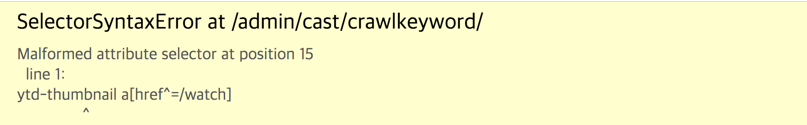

- ##### 크롤링 자체코드만 실행했을 때에는 잘 동작하던 코드가 장고서버내에서 실행하니 에러가 났다!!



- ###  TroubleShooting

``` python
for a_tag in list_soup.select('ytd-thumbnail a[href^=/watch]') # <- 해당 부분에서 에러 발생

##### 해결법! ->

for a_tag in list_soup.select('ytd-thumbnail a[href^="/watch"]') # /watch 해당 부분에 ""를 감싸주면 해결~ 
```

